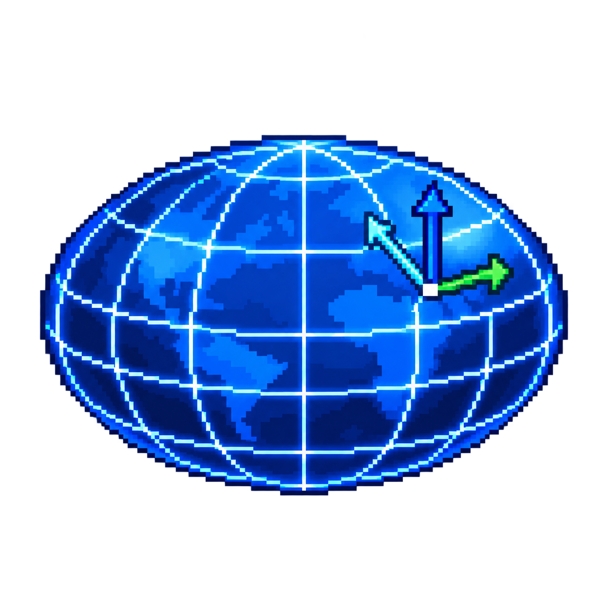

<p align="center">
  
</p>

# @spacexr/geodesy

Renderer-neutral TypeScript primitives for ellipsoids, geodetic coordinates, Earth-centred Earth-fixed coordinates and local tangent frames.

The package is extracted from the geodesy work originally developed in SpaceXR Core. It removes dependencies on Babylon.js, SpaceXR geometry classes, observables, tile metrics and application state. The result is a small reusable numerical foundation for 3D Tiles, terrain, mining models, globe navigation and planetary visualization.

## Design goals

- one immutable `Ellipsoid` as the source of every planetary dimension;
- one immutable `GeodeticSystem` for geodetic and ECEF conversions;
- explicit degree and radian APIs, without ambiguous boolean unit arguments;
- standard ECEF, ENU and NED axis conventions;
- optional output targets for allocation-free hot paths;
- no renderer, DOM, 3D Tiles or application dependency;
- JSDoc-compatible TSDoc on every public API;
- generated TypeDoc documentation;
- support for Earth and arbitrary oblate planetary bodies.

## Installation

```bash
npm install @spacexr/geodesy
```

The package is ESM and requires Node.js 20.11 or later when used directly in Node.js. Its runtime code has no external dependency.

## Coordinate conventions

| System   | X                       | Y                                     | Z                  | Angular unit                |
| -------- | ----------------------- | ------------------------------------- | ------------------ | --------------------------- |
| ECEF     | latitude 0, longitude 0 | latitude 0, longitude 90 degrees east | north pole         | none                        |
| ENU      | east                    | north                                 | up                 | none                        |
| NED      | north                   | east                                  | down               | none                        |
| Geodetic | longitude               | latitude                              | ellipsoidal height | explicit degrees or radians |

Cartesian values and ellipsoidal heights are expressed in metres. `GeodeticSystem` follows the EPSG:4978 ECEF orientation. Geographic values correspond to ellipsoidal longitude, geodetic latitude and ellipsoidal height as used by EPSG:4979, with an explicit API method defining whether angles are degrees or radians.

Matrices are column-major and multiply column vectors. This matches glTF and 3D Tiles transform storage.

## Ellipsoids

```ts
import { Ellipsoid } from "@spacexr/geodesy";

const earth = Ellipsoid.WGS84;

console.log(earth.semiMajorAxis); // 6378137 metres
console.log(earth.semiMinorAxis); // 6356752.314245179 metres
console.log(earth.inverseFlattening); // 298.257223563

const mars = Ellipsoid.fromAxes("Mars", 3396190, 3376200);
const moon = Ellipsoid.sphere("Moon", 1737400);
```

Included reference ellipsoids are WGS84, GRS80, GRS67, ANS, WGS72, Clarke 1858 and Clarke 1880. Applications can create additional oblate ellipsoids from axes, flattening or inverse flattening.

## Geodetic to ECEF

```ts
import { GeodeticSystem } from "@spacexr/geodesy";

const system = GeodeticSystem.WGS84;

const ecef = system.geodeticDegreesToEcef(
    48.8566, // latitude
    2.3522, // longitude
    35, // ellipsoidal height
);

const geodetic = system.ecefToGeodeticDegrees(ecef);
```

Equivalent `geodeticRadiansToEcef` and `ecefToGeodeticRadians` methods are provided for formats such as 3D Tiles regions, whose longitudes and latitudes are serialized in radians.

Every conversion accepts an optional mutable target:

```ts
const target = { x: 0, y: 0, z: 0 };

system.geodeticRadiansToEcef(latitude, longitude, height, target);
```

This avoids temporary allocations during traversal, camera updates and terrain generation.

## Local ENU and NED frames

```ts
const localFrame = system.createLocalTangentPlaneDegrees(48.8566, 2.3522, 35);

const localEnu = localFrame.ecefToEnu(ecefPoint);
const worldEcef = localFrame.enuToEcef(localEnu);

const localNed = localFrame.ecefToNed(ecefPoint);
```

The local frame is immutable. Its `basis` is the canonical east, north, up tangent basis expressed as ECEF unit vectors. ENU and NED are two coordinate conventions derived from that single basis, so they cannot drift apart.

It exposes defensive copies of its basis and transform matrices:

```ts
const basis = localFrame.basis;
const ecefToEnu = localFrame.ecefToEnuMatrix;
const enuToEcef = localFrame.enuToEcefMatrix;
const ecefToNed = localFrame.ecefToNedMatrix;
const nedToEcef = localFrame.nedToEcefMatrix;
```

The conventions are:

```text
ENU = [east, north, up]
NED = [north, east, -up]
```

NED is the local navigation convention commonly used in aviation and inertial navigation. An aircraft body frame such as FRD, forward, right, down, is a separate orientation layer derived from NED through heading, pitch and roll. It is deliberately not embedded in the geodetic tangent basis.

This model replaces the mutable ENU state and event dependency that existed in the original SpaceXR implementation. Applications can create a new local frame when their floating origin changes without mutating the planetary reference system.

## Migration from SpaceXR Core

The package preserves the useful concepts while making units and state explicit:

| SpaceXR Core API                                      | `@spacexr/geodesy` API                                                 |
| ----------------------------------------------------- | ---------------------------------------------------------------------- |
| `Ellipsoid.FromAAndInverseF(...)`                     | `Ellipsoid.fromSemiMajorAxisAndInverseFlattening(...)`                 |
| `Ellipsoid.FromAAndF(...)`                            | `Ellipsoid.fromSemiMajorAxisAndFlattening(...)`                        |
| `GeodeticSystem.Default`                              | `GeodeticSystem.WGS84`                                                 |
| `geodeticFloatToCartesianToRef(..., deg)`             | `geodeticDegreesToEcef(...)` or `geodeticRadiansToEcef(...)`           |
| `cartesianToGeodetic(...)`                            | `ecefToGeodeticDegrees(...)` or `ecefToGeodeticRadians(...)`           |
| mutable `ENUReference`, transform and observable      | immutable `LocalTangentPlane` returned by `createLocalTangentPlane...` |
| public underscore-prefixed ellipsoid calculation data | documented immutable properties and curvature methods                  |

The old `MapScale` utility is not part of this numerical kernel because it depends on tile metrics, display resolution and level-of-detail policy. Those concerns belong to the tiling or presentation layer. The legacy flat-Earth and spherical route calculators are also outside version 0.1. Their distance approximations can be introduced later as an independent geodesic module with explicit angular units and dedicated accuracy tests.

## 3D Tiles integration

`@spacexr/3d-tiles-runtime` consumes this package through its ECEF spatial adapter:

```ts
import { Ellipsoid, GeodeticSystem } from "@spacexr/geodesy";
import { EcefSpatialMetric } from "@spacexr/3d-tiles-runtime";

const mars = Ellipsoid.fromAxes("Mars", 3396190, 3376200);
const metric = new EcefSpatialMetric({
    geodeticSystem: new GeodeticSystem(mars),
});
```

The geodesy package owns ellipsoid and coordinate mathematics. The 3D Tiles runtime remains responsible for tile transforms, bounding volumes, visibility, horizon culling and screen-space error.

## API documentation

Every exported class, interface, constant and method carries JSDoc-compatible TSDoc, including parameter units, return units, coordinate axes and numerical edge cases.

Generate the browsable API site with:

```bash
npm run docs
```

The generated site is written to `docs/api/`.

## Development

```bash
npm install
npm run check
```

`npm run check` verifies formatting, lint rules, TypeScript types, numerical tests, the production package and the generated API documentation.

The package can also be inspected before publishing:

```bash
npm pack --dry-run
```

## Brand assets

The pixel-art globe represents an oblate reference ellipsoid, its geodetic grid and a local tangent frame.

<p align="center">
  
</p>

- [Horizontal logo](assets/brand/geodesy-logo.png)
- [Square icon](assets/brand/geodesy-icon.png)

## License

Apache-2.0. See [LICENSE](LICENSE).
